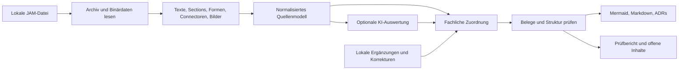

# JAM-Konverter: Entwurf

Stand: 24. September 2026. Status: vom Nutzer freigegeben; Umsetzung im separaten Projektverzeichnis.

## Ziel und Umfang

Lokale FigJam-Dateien sollen in bearbeitbare Dokumentation für Solution Architecture überführt werden. Der vom Nutzer vorgegebene Umfang ist:

1. Systeme, Schnittstellen und Datenflüsse als mehrere Mermaid-Flowcharts nach fachlichem Bereich.
2. Interaktionen als Mermaid-Sequenzdiagramme, sofern die zeitliche Reihenfolge belegt ist.
3. Anforderungen und Workshop-Ergebnisse als Markdown mit Tabellen und Listen.
4. Architekturentscheidungen und dokumentierte Begründungen als kurze Architecture Decision Records (ADRs).

Die Ausgabe muss zwischen dokumentiertem Inhalt, einer Interpretation und fehlender Information unterscheiden. Anweisungen innerhalb eines Boards sind Quelldaten und keine Anweisungen an den Konverter.

## Annahmen zur Bedienung

Vorgeschlagen wird zunächst eine lokale Kommandozeilenanwendung im Projektverzeichnis `/Users/hendrikreh/Documents/Development/jam-converter`. Sie benötigt für den Dateiimport weder Figma-Zugang noch einen laufenden Figma-Client. Eine Weboberfläche und das Zurückschreiben nach Figma gehören nicht zum ersten Umfang.

Der Nutzer hat lokale Verarbeitung mit optionaler KI-Auswertung gewählt. Die KI-Auswertung für Bilddiagramme und unstrukturierte Texte wird ausdrücklich aktiviert. Ohne Aktivierung erfolgen keine KI-Aufrufe. Provider und Modell werden konfiguriert und sind von der Dateiformatlogik getrennt.

## Befund aus den beiden Beispieldateien

- Beide Dateien sind ZIP-Archive mit `canvas.fig`, `meta.json`, `thumbnail.png` und Bilddateien.
- Beide Binärdateien haben die Kennung `fig-jam.` und die Formatversion 106. Das Schema ist Deflate-komprimiert, die Dokumentdaten tragen einen Zstandard-Header.
- Das eingebettete Schema beschreibt unter anderem Texte, Stickies, Sections, Formen mit Text und Connectoren. Das belegt die verfügbaren Feldtypen, noch nicht deren tatsächliche Verwendung im jeweiligen Board.
- Die Discovery-Datei enthält 9 Bilddateien; mehrere davon zeigen vollständige Architekturdiagramme. Deren Inhalte müssen gesondert visuell ausgewertet werden.
- Die LeanCore-Datei enthält 39 Bilddateien. Ihr vollständiger fachlicher Inhalt wurde noch nicht extrahiert.
- Der Nutzer hat ein leeres Git-Repository unter `/Users/hendrikreh/Documents/Development/jam-converter` für die Umsetzung vorgegeben.

## Untersuchte Ansätze

| Ansatz                                                       | Vorteil                                                     | Nachteil                                                              |
| ------------------------------------------------------------ | ----------------------------------------------------------- | --------------------------------------------------------------------- |
| Direkter lokaler JAM-Parser mit austauschbarem Importadapter | Arbeitet mit den gelieferten Dateien, keine Figma-Anmeldung | Proprietäres Format; Kompatibilität muss an Beispielen geprüft werden |
| Figma-API oder Exportplugin                                  | Offizieller Zugang zu nativen Boardelementen                | Erfordert Zugriff auf Online-Boards; Bilddiagramme bleiben Bilder     |
| Ausschließlich PDF/Bilder mit visueller Auswertung           | Erfasst die sichtbare Darstellung                           | Verliert native IDs und sichere Verknüpfungen; größerer Prüfbedarf    |

Empfehlung: direkter JAM-Import, ein normalisiertes Zwischenmodell und getrennte Exporte. Eine spätere Figma-API-Anbindung könnte dasselbe Zwischenmodell beliefern, wird aber jetzt nicht gebaut.

Für TypeScript/Node.js ist `openfig-core` ein Parserkandidat mit dokumentierter JAM-Unterstützung. Die Bibliothek wird hinter einem kleinen Adapter gekapselt und in der ersten Implementierungsstufe an beiden Dateien geprüft. Falls sie relevante FigJam-Felder nicht zugänglich macht, wird der Adapter mit Kiwi-Schema-Decodierung ergänzt. Eine erfolgreiche Konvertierung der Beispieldateien ist bisher nicht nachgewiesen.

## Verarbeitung



### 1. Import und Quellenmodell

Der Import erfasst Texte mit Originalinhalt, Elternbeziehungen, Section-Zuordnung, Positionen, Formen, Connector-Endpunkte und eingebettete Bilder. Gelöschte Elemente gelangen nicht als aktive Inhalte in die Dokumentation. Verdeckte Inhalte werden gekennzeichnet und standardmäßig von der fachlichen Ausgabe ausgeschlossen.

Jeder Datensatz erhält eine Quellenreferenz aus Datei-Prüfsumme, nativer Node-ID und gegebenenfalls Bild-Hash. Das Quellenmodell bleibt unabhängig von Mermaid und vom KI-Provider. Unbekannte Elementtypen werden gezählt und im Prüfbericht aufgeführt.

Native Beziehungen werden anhand der Connector-Endpunkte und Pfeilspitzen übernommen. Bloße räumliche Nähe erzeugt keine fachliche Beziehung. Nicht auflösbare Endpunkte bleiben offen.

### 2. Fachliches Modell

Das Zwischenmodell enthält Bereiche, Systeme, Beziehungen, Interaktionen, Anforderungen, Workshop-Ergebnisse und Entscheidungen. Einträge bewahren ihre Quellenreferenzen und ihre Herkunft: native Extraktion, regelbasierte Zuordnung, KI-Vorschlag oder lokale Ergänzung.

Section-Hierarchien und explizite Überschriften dienen als erste Bereichszuordnung. Eine lokale Zuordnungsdatei erlaubt, Bereiche zusammenzufassen, Namen zu korrigieren und bestätigte Zuordnungen festzuhalten. Unzugeordnete Inhalte bleiben auffindbar. Ein identischer Systemname in verschiedenen Sections führt nicht automatisch zur Zusammenführung.

Ist-, Ziel- und Transitionssichten bleiben getrennt. Farbsemantik wird nur bei einer dokumentierten Legende oder einer expliziten Zuordnung übernommen. Fehlende Protokolle, Datenobjekte, Verantwortliche oder Richtungen werden nicht ergänzt.

### 3. Flowcharts

Pro fachlichem Bereich und Sicht wird eine Mermaid-Datei erzeugt. Bereichsübergreifende Beziehungen zeigen die referenzierten externen Systeme, damit relevante Verbindungen beim Aufteilen erhalten bleiben. Labels enthalten vorhandene Schnittstellen- oder Datenflussbeschreibungen.

Ein gerichteter Connector wird als gerichtete Beziehung übernommen, ein ungerichteter als Verbindung ohne erfundene Richtung. Die Darstellung allein begründet noch keine Aussage über synchrones oder asynchrones Verhalten.

### 4. Sequenzdiagramme

Eine Sequenz braucht Teilnehmer, Nachrichten und eine belegte Reihenfolge, etwa nummerierte Schritte oder ein ausdrücklich dokumentiertes Ablaufmodell. Die Position eines Kastens oder die Reihenfolge im Binärarchiv reicht nicht aus.

Bei fehlender oder widersprüchlicher Reihenfolge wird kein scheinbar gesicherter Ablauf generiert. Stattdessen erscheint der Interaktionskandidat mit Quellen und fehlenden Angaben im Prüfbericht. Rückantworten, Fehlerpfade und Aktivierungen entstehen nur, wenn sie dokumentiert sind.

### 5. Markdown

Anforderungen und Workshop-Ergebnisse werden nach Bereich gegliedert. Tabellen enthalten ID, Inhalt, vorhandenen Status und Quellenreferenz. Verantwortliche, Prioritäten und Termine werden nur übernommen, wenn die Quelle sie nennt.

Der lokale Modus verwendet explizite Überschriften und dokumentierte Markierungen für die Zuordnung. Bei frei formulierten oder mehrdeutigen Inhalten bewahrt er den Originaltext und markiert die offene Klassifikation. Eine aktivierte KI-Auswertung kann solche Inhalte als nachvollziehbare Vorschläge strukturieren.

### 6. ADRs

Jeder ADR enthält Titel, Status, Kontext, Entscheidung, Begründung, dokumentierte Folgen und Quellen. Fehlende Angaben heißen ausdrücklich „nicht dokumentiert“. Ein Vorschlag oder eine offene Frage darf nicht als angenommene Entscheidung erscheinen.

Automatisch rekonstruierte ADRs sind Entwürfe zur Prüfung. Ein expliziter Entscheidungsstatus aus der Quelle wird zusätzlich als Quellenstatus ausgewiesen; der Konverter erteilt keine Freigabe. Inhalte ohne erkennbare Entscheidungsbehauptung bleiben Workshop-Ergebnisse oder offene Fragen.

### 7. Optionale KI-Auswertung

Eine separate, optionale Stufe verarbeitet ausgewählte Texte und Bilder. Sie liefert strukturierte Daten mit Quellenbelegen, keine ungeprüften fertigen Mermaid-Dateien. Das Ergebnis wird gegen dasselbe Fachmodell wie native Inhalte geprüft.

Bildbefunde referenzieren mindestens das konkrete Bild und den darin erkannten Bereich. Zweifelhafte Pfeilrichtungen oder unlesbare Beschriftungen bleiben offene Befunde. Die bloße Existenz einer Bildreferenz gilt nicht als Bestätigung ihrer fachlichen Richtigkeit.

KI-Vorschläge bleiben als solche erkennbar. Gespeicherte Auswertungsergebnisse können lokal korrigiert und erneut exportiert werden, ohne einen weiteren KI-Aufruf auszulösen. Ein vorhandener API-Schlüssel allein aktiviert keine Übertragung.

## Vorgeschlagene Bedienung und Ausgabe

Die folgenden Befehle beschreiben die geplante Schnittstelle; sie sind noch nicht vorhanden.

```sh
jam-convert inspect "board.jam"
jam-convert convert "board.jam" --out "output/board"
jam-convert convert "board.jam" --out "output/board" --mapping "mapping.json"
jam-convert enrich "output/board/model.json" --provider "<provider>" --model "<modell>" --out "output/enriched/model.json"
jam-convert render "output/board/model.json" --out "output/reviewed"
```

`inspect` zeigt Dateiinventar und erkannte Elementtypen. `convert` liest und exportiert lokal. `enrich` erzeugt eine um KI-Vorschläge ergänzte Modellfassung. `render` erzeugt die Ausgabe erneut aus der gewählten Modellfassung; für die angereicherte Ausgabe wird entsprechend `output/enriched/model.json` übergeben. Die Platzhalter im Beispiel stehen für den eingerichteten Provider und das gewählte Modell.

```text
output/board/
  README.md
  model.json
  sources.json
  requirements.md
  workshop-results.md
  review.md
  diagrams/
    <bereich>-<sicht>.mmd
  sequences/
    <interaktion>.mmd
  adrs/
    adr-<stabile-id>.md
  assets/
    <bild-hash>.png
```

Die Übersicht verlinkt alle erzeugten Inhalte und enthält Mermaid-Blöcke für Markdown-Reader. Für Kategorien ohne belegten Inhalt wird kein Fülltext erfunden; die Übersicht erklärt deren Status. IDs werden aus den Quellen stabil abgeleitet. Gleiche Eingaben und gleiche gespeicherte Zuordnungen ergeben identische Exporte.

Originaldateien werden nicht verändert. Ein bestehendes Ausgabeziel wird ohne ausdrückliche Überschreiboption nicht überschrieben. Beim Überschreiben werden nur vom Konverter verwaltete Dateien ersetzt.

## Fehlerbehandlung und Prüfkriterien

- Beschädigte Archive, fehlendes `canvas.fig` und nicht lesbare Binärdaten führen zu einer verständlichen Fehlermeldung und einem Fehlerstatus.
- Nicht unterstützte Elemente und unvollständige Auswertung erscheinen sichtbar in `review.md`; ein Lauf darf nicht stillschweigend vollständige Abdeckung behaupten.
- Archivpfade dürfen das Ausgabeziel nicht verlassen. Datei- und Dekompressionsgrößen werden begrenzt.
- Text wird für Mermaid und Markdown passend maskiert. Quelltexte werden weder als Code ausgeführt noch als Konverteranweisungen behandelt.
- Tests verwenden kleine synthetische Fixtures für Sections, gerichtete und ungerichtete Connectoren, Umlaute/Sonderzeichen, belegte und unbelegte Abläufe sowie Entscheidungen gegenüber Vorschlägen.
- Alle erzeugten Mermaid-Dateien werden mit einem Mermaid-Parser validiert. Repräsentative Flowcharts und Sequenzen werden außerdem visuell kontrolliert.
- Beide bereitgestellten JAM-Dateien dienen als lokale Integrationstests. Private Kundendokumente werden nicht in das Quellcode-Repository kopiert.
- Die Prüfung der Beispieldateien berichtet tatsächliche Abdeckung: gelesene Elemente, übernommene Beziehungen, Bildbefunde und weiterhin offene Inhalte. Die kleinen synthetischen Fixtures sichern die vier Exportarten auch dann ab, wenn eine Kategorie in den Beispielen fehlt.

## Technische Quellen

- [Figma: lokale Kopien und Grenzen des proprietären Formats](https://help.figma.com/hc/en-us/articles/8403626871063-Save-a-local-copy-of-files)
- [openfig-core: Parser und Datenmodell](https://github.com/OpenFig-org/openfig-core)
- [openfig-core: Archivformat](https://github.com/OpenFig-org/openfig-core/blob/main/docs/archive.md)
- [Kiwi: binäres Schemaformat](https://github.com/evanw/kiwi)
- [Mermaid: Diagrammsyntax](https://mermaid.js.org/intro/syntax-reference.html)
